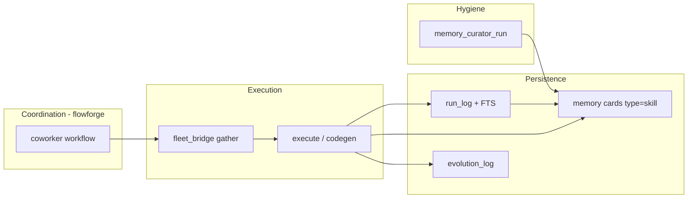

# Hermes → Fritz: Self-Improvement Mapping

> **Status: PRELIMINARY** — design map only; tools marked *planned* are not implemented unless noted *shipped*.
>
> **Goal:** Port the *useful* parts of Hermes Agent’s learning loop into `fleet-agent-mcp` (Fritz) without adopting the Hermes runtime, gateway, or “LLM decides what to do next” coordination model.
>
> **Related:** [coworker-plan.md](./coworker-plan.md) · [SPEC.md](../SPEC.md) · mcp-central-docs [fritz-coworker](https://github.com/sandraschi/mcp-central-docs/blob/main/projects/fritz-coworker/README.md)

---

## 1. What Hermes Actually Does (de-mystified)

Hermes “self-improving” is **not** offline RL. It is:

| Layer | Hermes mechanism | Fritz analogue today |
|-------|------------------|----------------------|
| **Nudge** | System prompt: after 5+ tool calls, save via `skill_manage` | Workflow `record` node + SOUL; no hard rule |
| **Write** | `skill_manage(create\|patch)` → `~/.hermes/skills/*.md` | `memory_card_create` / `memory_card_update` |
| **Recall** | Progressive skill index + `session_search` (FTS5 on messages) | `memory_card_search` (SQL `LIKE`) |
| **Hygiene** | Curator: archive stale *agent* skills, pin, backup | `memory_lint` only; no lifecycle |
| **Honesty** | Curator never deletes; evolution is separate | `evolution_record` (*shipped*) — explicit mistakes |
| **Anti-spin** | Kanban `failure_limit` → auto-block task | Not in flowforge yet |

Fritz’s advantage: **YAML decides the pipeline**; Hermes’s risk: model skips saving or over-saves slop.

---

## 2. Target Fritz Loop (Poor Man’s Hermes)



**Invariant (Fritz policy):** Agent-authored skills require `created_by: agent` and never hard-delete — archive to `~/.fleet-agent/cards/.archive/` like Hermes Curator.

---

## 3. Component Map (Hermes → Fritz)

| Hermes | Fritz target | Priority |
|--------|--------------|----------|
| `skill_manage` + prompt nudges | `memory_card_create` with `card_type=skill` + workflow recipe | P0 |
| `skill_usage.json` telemetry | `memory_cards.metadata` + `memory_card_touch` | P0 |
| `session_search` (FTS5) | `run_search` / `run_show` on coworker runs | P0 |
| `agent/curator.py` | `memory_curator_*` tools (archive/pin/run) | P1 |
| Kanban `failure_limit` | `workflow_failure_record` + blocked instance | P1 |
| Checkpoints v2 | `coworker_checkpoint_*` on execute paths | P2 |
| `agentskills.io` SKILL.md | Card frontmatter spec (below) | P0 |
| Gateway / 22 platforms | **Skip** — `notify` + `discord-mcp` | — |
| Honcho / mem0 plugins | **Skip** — `advanced-memory-mcp` optional | — |
| `delegate_task` tree | **Skip** — `fleet_bridge` fan-out cap (5) | — |

---

## 4. Schema Additions (SQLite)

### 4.1 `agent_runs` (new) — Hermes `session_search` for *deliverables*

```sql
CREATE TABLE IF NOT EXISTS agent_runs (
    id TEXT PRIMARY KEY,
    workflow TEXT NOT NULL,
    instance_id TEXT,
    node TEXT,
    trigger TEXT,              -- heartbeat | pulse | manual | scheduler
    status TEXT NOT NULL,      -- ok | fail | partial
    summary TEXT,
    deliverable TEXT,          -- markdown body or path
    error TEXT,
    tool_calls INTEGER DEFAULT 0,
    fleet_calls INTEGER DEFAULT 0,
    started_at TEXT NOT NULL,
    ended_at TEXT,
    metadata_json TEXT DEFAULT '{}'
);

-- FTS5 (migration v2)
CREATE VIRTUAL TABLE IF NOT EXISTS agent_runs_fts USING fts5(
    summary, deliverable, error,
    content='agent_runs', content_rowid='rowid'
);
```

### 4.2 `memory_cards` extensions

| Column / metadata key | Purpose |
|----------------------|---------|
| `card_type` | `skill` \| `concept` \| `pattern` \| `lesson` \| `reference` |
| `created_by` | `human` \| `agent` \| `import` |
| `pinned` | bool — curator exempt |
| `archived_at` | ISO timestamp; null = active |
| `use_count`, `last_used_at`, `patch_count` | Curator telemetry |

Archive path on disk: `~/.fleet-agent/cards/.archive/<card_id>.md` (mirror of Hermes `skills/.archive/`).

### 4.3 `workflow_instances` extensions

| Field | Purpose |
|-------|---------|
| `failure_count` | Increment on failed `workflow_next` at same node |
| `blocked` | bool — set when `failure_count >= failure_limit` |
| `blocked_reason` | text — surfaced in `heartbeat_wake` |

Config: `failure_limit` default **2** (Hermes Kanban default).

---

## 5. MCP Tools (planned surface)

### 5.1 Run log — session recall for coworkers

| Tool | R/W | Hermes source | Behavior |
|------|-----|---------------|----------|
| `run_log_append` | M | (implicit session DB) | Append one run row at end of `coworker` / scheduled flow |
| `run_search` | R | `session_search` | FTS5 keyword search; return id, workflow, snippet, `started_at` |
| `run_show` | R | `session_search(session_id, window)` | Full deliverable + errors for one run |

**Wire-in (P0):** Call `run_log_append` from `coworker/fleet_pulse.py`, `board_pack.py`, and future flows after deliver step.

### 5.2 Skills — procedural memory

| Tool | R/W | Hermes source | Behavior |
|------|-----|---------------|----------|
| `memory_card_create` | M | `skill_manage(create)` | *Extend:* `card_type`, `created_by`, `category=skill` |
| `memory_card_update` | M | `skill_manage(patch)` | *Extend:* bump `patch_count`; optional `memory_card_touch` |
| `memory_card_touch` | M | `skill_usage` view/patch | Increment `use_count` when card loaded in gather |
| `memory_card_record_run` | M | nudge + create | If run qualifies, draft skill card from template (see §6) |
| `memory_card_pin` | M | `hermes curator pin` | Set `pinned=true` |
| `memory_card_archive` | M | curator archive | Move to `.archive/`; set `archived_at` |
| `memory_card_restore` | M | curator restore | Reverse archive |
| `memory_card_search` | R | skill index | *Extend:* FTS5; filter `card_type`, `include_archived` |

### 5.3 Curator — janitor (agent skills only)

| Tool | R/W | Hermes source | Behavior |
|------|-----|---------------|----------|
| `memory_curator_status` | R | `hermes curator status` | Counts: active / stale / archived / pinned |
| `memory_curator_run` | M | `hermes curator run` | Apply rules: stale 30d → flag; archive 90d idle agent skills |

**Rules (copy Hermes invariants):**

- Only `created_by=agent` AND `card_type=skill`
- Never delete; archive only
- Pinned exempt
- Optional: LLM review pass → **Phase 2** (use local Ollama via robofang)

**Schedule:** Weekly pulse task or `notify` cron → `memory_curator_run(dry_run=False)`.

### 5.4 Workflow anti-spin

| Tool | R/W | Hermes source | Behavior |
|------|-----|---------------|----------|
| `workflow_failure_record` | M | Kanban failure counter | Increment `failure_count`; block at limit |
| `workflow_unblock` | M | `kanban_unblock` | Human clears block; resets counter |

**Wire-in:** `workflow_next` on branch `fail` calls `workflow_failure_record` before returning status.

### 5.5 Safety (execute phase)

| Tool | R/W | Hermes source | Behavior |
|------|-----|---------------|----------|
| `coworker_checkpoint_create` | M | checkpoints v2 | Snapshot target repo path or git stash ref |
| `coworker_checkpoint_rollback` | M | `/rollback` | Restore last checkpoint for workflow instance |

**Scope:** `fritz-test-work`, contribution workflow only (P2).

---

## 6. When to auto-record a skill (`memory_card_record_run`)

Hermes heuristic (prompt): 5+ tool calls, fixed error path, user correction.

Fritz **deterministic** rules (recommended):

| Condition | Action |
|-----------|--------|
| Workflow `coworker` reached `record` node AND `status=ok` | Eligible |
| `fleet_calls >= 3` OR `tool_calls >= 5` | Eligible |
| Deliverable matches existing skill title (FTS) | `memory_card_update` (patch) + `patch_count++` |
| Else new skill | `memory_card_create` with template below |
| Run failed | `evolution_record` only — **no** auto-skill |
| `created_by=human` card same title | Never overwrite without `group=human` pulse |

### Skill card template (agentskills.io-aligned)

```markdown
---
name: fleet-pulse-report-v1
description: Format and tool chain for Morning Fleet Pulse deliverable
card_type: skill
created_by: agent
tags: [coworker, fleet-pulse, format]
version: 1
metadata:
  fritz:
    source_run: "<run_id>"
    workflow: coworker
    fleet_calls: 4
---

# Fleet Pulse — delivery skill

## When to use
Scheduled 07:00 Europe/Vienna or manual `coworker_fleet_pulse`.

## Tool chain
1. heartbeat_status
2. fleet_list_servers
3. …

## Output
See deliverable in run_log `<run_id>`.

## Pitfalls
- …
```

---

## 7. Workflow integration

### 7.1 `workflows/coworker.yaml` (add to `record` node task text)

```yaml
# record node task (append to NL description)
- run_log_append from this instance
- memory_card_search for existing coworker skills
- memory_card_record_run if eligible else memory_project_note only
- memory_card_touch on any card loaded in gather
```

### 7.2 `heartbeat_wake` (extend)

When `workflow_status` returns `blocked: true`:

```json
{
  "action": "blocked",
  "workflow": "contribution",
  "reason": "failure_limit reached at node test",
  "suggestion": "pulse_add human task or workflow_unblock"
}
```

### 7.3 Morning Fleet Pulse (pilot 1)

| Step | Tool |
|------|------|
| Pre-gather | `memory_card_search("fleet pulse")` |
| Post-deliver | `run_log_append` + `memory_card_record_run` |
| Debug last week | `run_search("git-github fail")` |

---

## 8. Implementation phases

### P0 — Ship with v0.2 coworker soak

- [ ] `agent_runs` table + `run_log_append` / `run_search` / `run_show`
- [ ] Extend `memory_card_create` / `search` with `card_type`, `created_by`, FTS5
- [ ] `memory_card_record_run` (template only; no LLM author)
- [ ] Wire `run_log_append` into existing coworker flows
- [ ] Document frontmatter in [coworker-plan.md](./coworker-plan.md) § Skills

### P1 — Hygiene + reliability

- [ ] `memory_card_pin` / `archive` / `restore` + `.archive/` dir
- [ ] `memory_curator_status` / `memory_curator_run`
- [ ] `workflow_failure_record` + `failure_limit` in config
- [ ] Weekly scheduled curator via `notify`

### P2 — Optional

- [ ] `coworker_checkpoint_*`
- [ ] Curator LLM review pass (local model)
- [ ] `memory_card_touch` from webapp when user opens card

---

## 9. Explicit non-goals

Do **not** port into Fritz:

- Hermes gateway adapters (Telegram, WeCom, …)
- `skill_manage` delete on bundled skills
- Agent-created skills without provenance
- Curator deleting cards (archive only)
- Prompt-only “self improve” without workflow `record` enforcement
- Installing `hermes-agent` PyPI package as a dependency

---

## 10. Success metrics (how we know it works)

| Metric | Target |
|--------|--------|
| Repeat coworker run uses prior skill | `memory_card_touch` on same skill ≥2 in 7 days |
| Pulse debug time | `run_search` finds last failure in &lt;1 tool call |
| Slop control | Active `created_by=agent` skills &lt;30; archived rest |
| Spin loops | Zero instances with &gt;3 failures at same node without `blocked` |

---

## 11. Hermes file references (for implementers)

| Topic | Path in `hermes-agent` clone |
|-------|------------------------------|
| Curator | `agent/curator.py`, `agent/curator_backup.py` |
| Usage telemetry | `tools/skill_usage.py` |
| Session FTS | `hermes_state.py`, docs `user-guide/sessions.md` |
| Skill nudges | `agent/prompt_builder.py` (~L166) |
| Kanban failure | `plugins/kanban/`, `AGENTS.md` § Kanban |
| Skill format | `website/docs/user-guide/features/skills.md` |

---

*Last updated: 2026-06-02*
